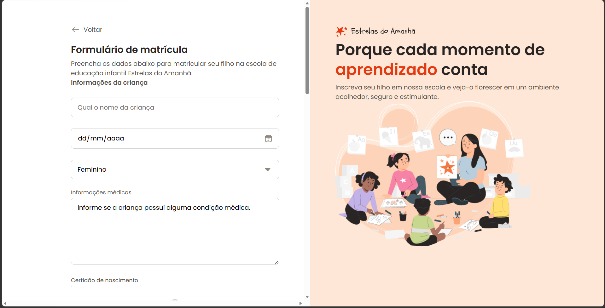

# Formulário de Matrícula - Estrelas do Amanhã

Este projeto é uma interface de formulário de matrícula para uma escola de educação infantil chamada Estrelas do Amanhã.  
O objetivo é proporcionar uma experiência simples, clara e acolhedora para o cadastro de crianças.

---

## Preview do Projeto

---

## Funcionalidades

- Formulário de matrícula completo
- Cadastro de informações da criança
- Seleção de data de nascimento
- Seleção de gênero
- Campo para informações médicas
- Upload de certidão de nascimento
- Layout moderno e responsivo
- Experiência amigável para o usuário

---

## Tecnologias utilizadas

- HTML5
- CSS3

---

## Objetivo do Projeto

Criar uma interface intuitiva e agradável para facilitar o processo de matrícula escolar, garantindo:

- Boa usabilidade
- Design limpo
- Clareza nas informações
- Experiência visual agradável

---

## Como executar

1. Clone o repositório:
git clone https://github.com/Anaelica/formulario-matricula.git

2. Acesse a pasta do projeto:
cd formulario-matricula

3. Abra o arquivo index.html no navegador.

---

## Autora

Desenvolvido por Anaelica.  
Projeto focado em prática de front-end e construção de interfaces reais.

---

